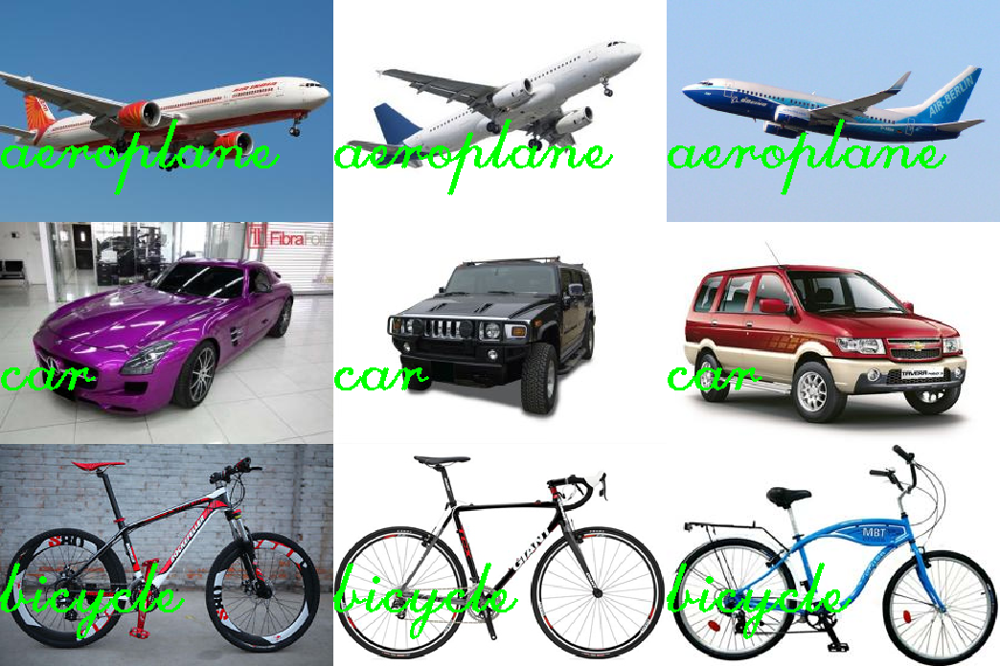

# bag-of-words

Python Implementation of Bag of Words for Image Recognition using OpenCV and
sklearn | [Video](https://www.youtube.com/watch?v=Ba_4wOpbJJM)

## Training the classifier
```
python findFeatures.py -t dataset/train/
```

## Testing the classifier
* Testing a number of images
```
python getClass.py -t dataset/test --visualize
```
* Testing a single image
```
python getClass.py -i dataset/test/aeroplane/test_1.jpg --visualize
```
